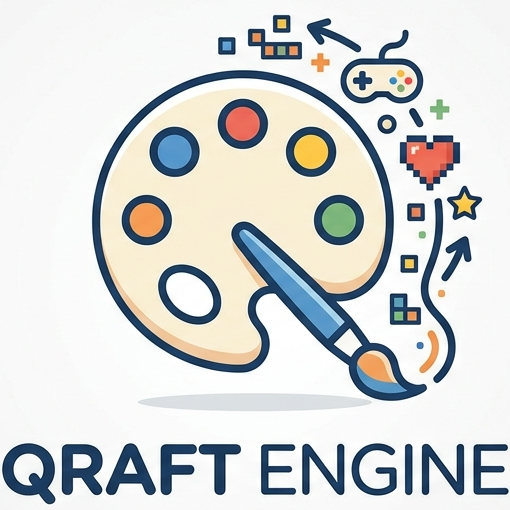

# 🎮 Qraft Engine

<p align="center">
  
</p>

<p align="center">
  <a href="https://www.youtube.com/watch?v=BBjlg-sMpcE"><strong>Introduction Video</strong></a>
  &nbsp;&nbsp;|&nbsp;&nbsp;
  <a href="https://youtu.be/6ty8wd_-XEU"><strong>GUI Version Demo</strong></a>
  &nbsp;&nbsp;|&nbsp;&nbsp;
  <a href="https://zqhhhhhh.github.io/zqhhhhhh/#/project"><strong>Portfolio</strong></a>
</p>

---

A 2D game engine built in C++17 + Lua + SDL2 + Box2D, supporting:

- Actor/Component architecture
- Scene loading and template instantiation
- Rigidbody physics and collision callbacks
- Raycast / RaycastAll
- EventBus (Publish/Subscribe/Unsubscribe)
- Particle system with full per-particle control
- Text, image, audio, input, and camera APIs
- **GUI version**: ImGui-based scene editor with hierarchy, inspector, play mode, and project hub

---

## 📁 1. Project Structure

```text
game_engine_qianhui/
├── apps/
│   └── main.cpp                     # Entry point (miniature / CLI version)
├── include/
│   ├── engine/                      # Engine/Actor/Scene/Template/Component API
│   ├── inputManager/                # Input interface
│   ├── particle/                    # ParticleSystem declarations
│   ├── physics/                     # Rigidbody/Raycast declarations
│   ├── renderer/                    # Rendering/Text/Audio declarations
│   ├── editor/                      # SceneEditor (GUI version) declarations
│   └── autograder/
├── src/
│   ├── engine/                      # Runtime core logic
│   ├── inputManager/
│   ├── particle/                    # ParticleSystem implementation
│   ├── physics/
│   ├── renderer/
│   └── editor/                      # SceneEditor (GUI version) implementation
├── resources/
│   ├── game.config                  # Game configuration (title, initial scene, etc.)
│   ├── rendering.config             # Resolution, clear color, camera offset, zoom, etc.
│   ├── scenes/                      # Scene files
│   ├── actor_templates/             # Actor templates
│   ├── component_types/             # Lua component scripts
│   ├── images/ fonts/ audio/        # Assets
├── executable/
│   ├── qraft_engine_linux           # Linux executable (miniature version)
│   ├── qraft_engine_osx/
│   │   ├── qraft_engine_osx         # macOS executable (miniature version)
│   │   └── frameworks/              # SDL2 frameworks
│   └── qraft_engine_windows/
│       ├── qraft_engine_win.exe
│       └── SDL2*.dll
├── qraft_engine_gui_osx             # macOS GUI version executable
├── document/
│   ├── README.md
│   ├── Logo.png
│   └── Logo_transparentBG.png
├── Makefile                         # Linux/macOS build
├── game_engine.xcodeproj            # Xcode project
└── game_engine.vcxproj              # Visual Studio project
```

---

## 📜 2. Lua API Overview

The following APIs are registered to Lua by the engine (`ComponentDB::InitializeFunctions`).

## 🧱 2.1 Classes

### `Vector2`

- Constructor: `Vector2(x, y)`
- Properties: `x`, `y`
- Member functions:
	- `Normalize()`
	- `Length()`
	- `__add(v)` (vector addition)
	- `__sub(v)` (vector subtraction)
	- `__mul(s)` (vector-scalar multiplication)
- Static functions:
	- `Vector2.Distance(a, b)`
	- `Vector2.Dot(a, b)`

### `Actor`

- `GetName()`
- `GetID()`
- `GetComponentByKey(key)`
- `GetComponent(type_name)`
- `GetComponents(type_name)`
- `AddComponent(type_name)`
- `RemoveComponent(component)`

### `Rigidbody`

- Accessible properties:
	- `key`, `type`, `enabled`, `actor`
	- `x`, `y`, `body_type`, `precise`
	- `gravity_scale`, `density`, `angular_friction`, `rotation`
	- `collider_type`, `width`, `height`, `radius`
	- `trigger_type`, `trigger_width`, `trigger_height`, `trigger_radius`
	- `friction`, `bounciness`, `has_collider`, `has_trigger`
- Functions:
	- Lifecycle: `OnStart()`, `OnDestroy()`
	- Getter: `GetPosition()`, `GetRotation()`, `GetVelocity()`, `GetAngularVelocity()`, `GetGravityScale()`
	- Direction: `GetUpDirection()`, `GetRightDirection()`
	- Setter / Dynamics: `AddForce(force)`, `SetVelocity(v)`, `SetPosition(pos)`, `SetRotation(deg)`, `SetAngularVelocity(deg)`, `SetGravityScale(s)`, `SetUpDirection(dir)`, `SetRightDirection(dir)`

### `ParticleSystem`

- Accessible properties:
	- `key`, `type`, `enabled`, `actor`
	- `x`, `y`
	- Emission: `emit_angle_min`, `emit_angle_max`, `emit_radius_min`, `emit_radius_max`
	- Burst: `frames_between_bursts`, `burst_quantity`
	- Scale: `start_scale_min`, `start_scale_max`, `end_scale`
	- Rotation: `rotation_min`, `rotation_max`, `rotation_speed_min`, `rotation_speed_max`
	- Speed: `start_speed_min`, `start_speed_max`
	- Color: `start_color_r`, `start_color_g`, `start_color_b`, `start_color_a`
	- Color (end): `end_color_r`, `end_color_g`, `end_color_b`, `end_color_a`
	- Physics: `gravity_scale_x`, `gravity_scale_y`, `drag_factor`, `angular_drag_factor`
	- Lifetime: `duration_frames`
	- Appearance: `image`, `sorting_order`
- Functions:
	- Lifecycle: `OnStart()`, `OnUpdate()`, `OnDestroy()`
	- Playback: `Play()`, `Stop()`, `Burst()`

### `HitResult`

- Properties:
	- `actor` (the Actor that was hit)
	- `point` (hit point as `Vector2`)
	- `normal` (normal vector as `Vector2`)

---

## 🔷 2.2 Namespaces

### `Actor`

- `Actor.Find(name)`
- `Actor.FindAll(name)`
- `Actor.Instantiate(template_name)`
- `Actor.Destroy(actor)`

### `Debug`

- `Debug.Log(message)`
- `Debug.LogError(message)`

### `Application`

- `Application.Quit()`
- `Application.Sleep(milliseconds)`
- `Application.OpenURL(url)`
- `Application.GetFrame()`

### `Input`

- Keyboard:
	- `Input.GetKey(keycode)`
	- `Input.GetKeyDown(keycode)`
	- `Input.GetKeyUp(keycode)`
- Mouse:
	- `Input.GetMousePosition()`
	- `Input.GetMouseButton(button)`
	- `Input.GetMouseButtonDown(button)`
	- `Input.GetMouseButtonUp(button)`
	- `Input.GetMouseScrollDelta()`
- Cursor:
	- `Input.HideCursor()`
	- `Input.ShowCursor()`

### `Text`

- `Text.Draw(content, x, y, font_name, font_size, r, g, b, a)`

### `Audio`

- `Audio.Play(channel, clip_name, loop)`
- `Audio.Halt(channel)`
- `Audio.SetVolume(channel, volume)`

### `Image`

- `Image.DrawUI(image_name, x, y)`
- `Image.DrawUIEx(image_name, x, y, r, g, b, a, sorting_order)`
- `Image.Draw(image_name, x, y)`
- `Image.DrawEx(image_name, x, y, rotation_degrees, scale_x, scale_y, pivot_x, pivot_y, r, g, b, a, sorting_order)`
- `Image.DrawPixel(x, y, r, g, b, a)`

### `Camera`

- `Camera.SetPosition(x, y)`
- `Camera.GetPositionX()`
- `Camera.GetPositionY()`
- `Camera.SetZoom(zoom)`
- `Camera.GetZoom()`

### `Scene`

- `Scene.Load(scene_name)`
- `Scene.GetCurrent()`
- `Scene.DontDestroy(actor)`

### `Physics`

- `Physics.Raycast(pos, dir, dist)`
	- Returns: closest `HitResult` hit; returns `nil` if no hit
- `Physics.RaycastAll(pos, dir, dist)`
	- Returns: hit array (Lua table) sorted by distance; returns empty table if no hits

### `Event`

- `Event.Publish(event_type, event_object)`
- `Event.Subscribe(event_type, component, function)`
- `Event.Unsubscribe(event_type, component, function)`

---

## 🚀 3. Running the Miniature Version (All Platforms)

This is the lightweight, CLI-only build of Qraft Engine — no editor GUI. It runs your game directly from a `resources/` folder.

Core requirement: `resources/` must be in the same directory as the executable.

## 🍎 3.1 macOS

Executable: `executable/qraft_engine_osx/qraft_engine_osx`

Recommended layout:

```text
qraft_engine_osx/
├── qraft_engine_osx
├── frameworks/
└── resources/
```

```bash
cd executable/qraft_engine_osx
cp -R ../../resources ./resources
./qraft_engine_osx
```

## 🐧 3.2 Linux

Executable: `executable/qraft_engine_linux`

Recommended layout:

```text
<run_dir>/
├── qraft_engine_linux
└── resources/
```

```bash
cd executable
cp -R ../resources ./resources
chmod +x qraft_engine_linux
./qraft_engine_linux
```

## 🪟 3.3 Windows

Executable: `executable/qraft_engine_windows/qraft_engine_win.exe`

Recommended layout:

```text
qraft_engine_windows/
├── qraft_engine_win.exe
├── SDL2.dll
├── SDL2_image.dll
├── SDL2_mixer.dll
├── SDL2_ttf.dll
└── resources/
```

Double-click `qraft_engine_win.exe` or launch from the command line.

---

## 🖥️ 4. Running the GUI Version (macOS only)

The GUI version of Qraft Engine ships with a built-in ImGui-based scene editor. It includes:

- **Project Hub** — create a new project or load an existing one by pointing to a `resources/` folder
- **Hierarchy panel** — view, rename, create, and delete actors in the current scene
- **Inspector panel** — add/remove components and edit their properties in real time
- **Controls bar** — enter/exit play mode; changes made during play are automatically reverted on stop
- **Viewport** — click to select actors directly in the game view
- **Scene management** — load, save, and switch between scenes from within the editor
- **Template support** — save actors as templates and instantiate them from the inspector
- **Hot reload** — Lua component scripts are watched and reloaded automatically on change

Executable: `qraft_engine_gui_osx` (project root)

```bash
./qraft_engine_gui_osx
```

The editor will open to the Project Hub on launch. Point it to a `resources/` folder to load an existing project, or create a new one from scratch.

> **Note:** The GUI version currently supports macOS only.

---

## 🗂️ 5. Assets and Script Conventions

- Engine loads on startup:
	- `resources/game.config`
	- `resources/rendering.config`
	- `resources/scenes/*.scene`
	- `resources/component_types/*.lua`
	- `resources/actor_templates/*.template`
	- `resources/images`, `resources/audio`, `resources/fonts`
- All runtime Lua component scripts must be placed in `resources/component_types/`.
- `ParticleSystem` components are configured via Lua properties and use any image from `resources/images/`; if no image is specified a built-in default particle texture is used.
